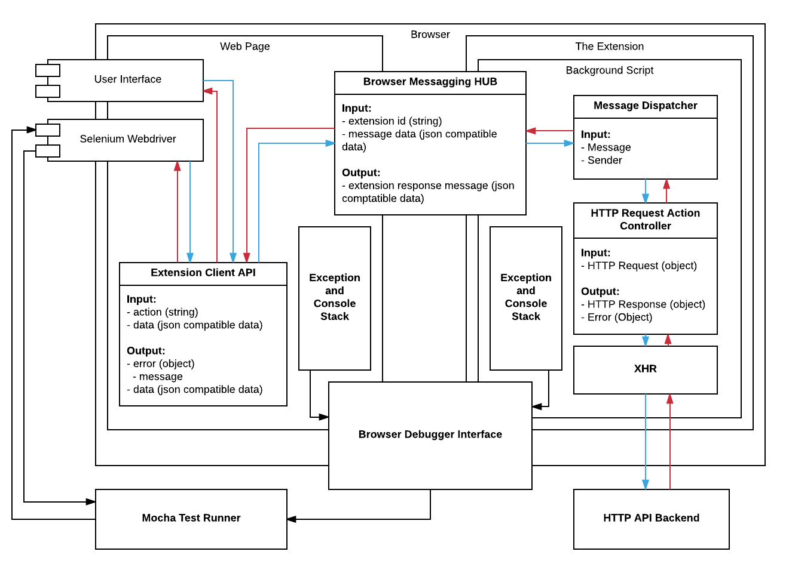

# Chrome Extension in Continuous Integration
[](https://travis-ci.org/apiaryio/chrome-extension-ci)


## The TDD/BDD Friendly Stack

- [Node.js](https://nodejs.org/en/) - Programming Language
- [Mocha](https://mochajs.org/) - Node.js test frameworks
- [Chai](http://chaijs.com/) - Node.js test assertion/framework
- [Browserify](http://browserify.org/) - To be able unit test everything locally and then inject it into the extension scope
- [Webdriver.io](http://webdriver.io/) - Node.js bindings and DSL for Selenium
- [selenium-standalone](https://github.com/vvo/selenium-standalone) - Node.js wrapper runnnig and fetching the Standalone selenium server and its dependencies (ChromeFriver etc...)
- [ChromeDriver](https://sites.google.com/a/chromium.org/chromedriver/capabilities) -Selenium driver for commanding Chrome
- [xvfb](https://docs.travis-ci.com/user/gui-and-headless-browsers/) (for headless Chrome in the CI) - Virtaul frame buffer for X server
- [Travis CI](https://travis-ci.org) - the CI



## How to TDD the unpacked chrome extension locally


- Install NPM dependecies
```
$ npm install
```

- Install Selenium Drivers
```
$ npm run selenium-install
```

- Spin up the Standalone Selenium Server
```
$ npm run selenium-start
```

- Run the tests suite
```
$ npm test
```

# External doc

- [Chrome Extension Cross-Origin XHR](https://developer.chrome.com/extensions/xhr)
- [Chrome Extension Background page](https://developer.chrome.com/extensions/background_pages)
- [Chrome Extension Manifest File format](https://developer.chrome.com/extensions/manifest)
- [Chrome Extension Permissions in manifest.json](https://developer.chrome.com/extensions/declare_permissions)
- [Web page communicastion to Chrome Extension](https://developer.chrome.com/extensions/messaging#external-webpage)
- [Chrome Extension Debugging](https://developer.chrome.com/extensions/tut_debugging)
- [Chrome Extension HTTP interception API](https://developer.chrome.com/extensions/webRequest)
- [Chrome Debugger Protocol](https://developer.chrome.com/devtools/docs/debugger-protocol)
- [Chrome Extension Debugger API](https://developer.chrome.com/extensions/debugger)
